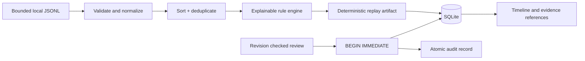

# Drishti — Login Incident Investigator

[](https://github.com/Siddh-sys-rgb/drishti-login-incident-investigator/actions/workflows/tests.yml)

An offline Flask investigation atlas for authentication events. Replay JSONL, explain each rule signal with original evidence IDs, record a human triage decision and retain a revision-checked audit trail. The interface uses an indigo and icy-blue timeline design distinct from the companion security project.

The demonstration follows fictional staff at Narmada Supplies in Ahmedabad. Names and events are authored. Every sample IP is a documentation-only address; the app does not probe login systems, perform attacks, query geolocation or transmit events.


## What works

- Strict, bounded JSONL parsing; timezone normalization; chronological replay and canonical event deduplication.
- Transparent rules for a failure burst followed by success, one-IP/multi-account failures and a new IP after an explicitly observed success baseline.
- Evidence references, false-positive explanations, a full timeline and human statuses: **open**, **investigating**, **expected activity** and **escalate for investigation**.
- Immutable replay content, deterministic run IDs, persistent review notes, optimistic revisions and an atomic SQLite audit transaction.
- Local upload/export, CSRF protection, safe literal rendering, session-cookie isolation, localhost host/origin checks and a restrictive CSP.

## Run on macOS or Linux

Use Python **3.11 or 3.12**. Node is optional for the JavaScript syntax check.

```bash
git clone https://github.com/Siddh-sys-rgb/drishti-login-incident-investigator.git
cd drishti-login-incident-investigator
python3 -m venv .venv
source .venv/bin/activate
python -m pip install -r requirements-dev.txt
python app.py --port 8115
```

Open **http://127.0.0.1:8115**. The application binds to localhost with debug off. Ignored `instance/` contains SQLite and the private session key. `requirements-tested.txt` records the exact development dependency set if a pinned environment is preferred.

## Run on Windows PowerShell

```powershell
git clone https://github.com/Siddh-sys-rgb/drishti-login-incident-investigator.git
cd drishti-login-incident-investigator
py -3.12 -m venv .venv
.\.venv\Scripts\python.exe -m pip install -r requirements-dev.txt
.\.venv\Scripts\python.exe app.py --port 8115
```

No script activation is required. Use `--data-dir instance-review` for an independent review workspace, or `--no-demo` to disable the fictional sample endpoint/button:

```bash
python app.py --port 8115 --data-dir instance-review --no-demo
```

Do not commit the data directory or session key. This is a localhost single-user demo without application account authentication; add authentication, authorization, HTTPS, retention controls and a production server before using it beyond that context.

## Three-minute walkthrough

1. Click **Load fictional scenario**, then **Replay & investigate**.
2. The sample contains **15 unique events** and **three rule signals**: Arjun Patel's failure burst then success, one-IP failures for four accounts, and Riya Shah's successful login from an IP not present in her observed baseline.
3. Select a signal. Read its explanation and its source event IDs. A rule result is a lead rather than proof of compromise.
4. For the multi-account failures, choose **Expected activity**, use investigator **Meera Desai**, and write `Shared office network; confirm training exercise with the team.` Save the review.
5. The review count and audit trail update. Every write advances the alert's revision. An outdated browser cannot silently replace a newer annotation.
6. Export the investigation. Its JSON includes normalized events, rule explanations, review state and audit records.
7. Upload the same events in reverse order. The same investigation ID is returned and the review is preserved.

## Event schema

One event per non-empty line, with exactly these four fields:

```json
{"timestamp":"2026-09-15T09:00:00Z","user":"riya.shah","ip":"192.0.2.10","outcome":"failure"}
```

- `timestamp`: ISO 8601 with an explicit timezone; normalized to UTC. Supported years 2000–2100.
- `user`: non-empty text of up to 80 characters, with no control characters. User IDs need not be actual email addresses.
- `ip`: valid IPv4 or IPv6. Equivalent IPv6 representations normalize to one value.
- `outcome`: exactly `success` or `failure`.

Unexpected fields are rejected to avoid accidentally retaining unrelated secrets. Invalid UTF-8, invalid JSON and `NaN`/`Infinity` are rejected. Event validation errors identify a line number, never quote supplied event content. Maximum **1,000 events**, **180,000 UTF-8 input bytes**, and **400 KB HTTP request body**.

## Rule semantics and limitations

| Rule | Evidence required | Possible benign explanation |
|---|---|---|
| Failure burst then success | Four unique failures for the same account/IP within **300 seconds inclusive**, followed by a success strictly later and within **600 seconds inclusive** of the last failure. | Mistyped credentials, helpdesk recovery or a training exercise. |
| One IP, multiple failing accounts | Failures for at least four distinct accounts from one IP within **600 seconds inclusive**. Overlapping observations in a contiguous segment are consolidated. | Shared office NAT, an authentication outage or a service test. |
| New IP after observed baseline | A successful login from an IP absent from at least two strictly earlier successful logins for the same user in this replay. | VPN, mobile network switching, travel or a new device. |

Rules are deterministic and **do not establish compromise**. A no-alert replay does not establish safety. Novelty refers only to the supplied finite dataset, not a verified historical user profile. Simultaneous events cannot establish a causal ordering or a prior baseline. The upload's actual input order has no meaning after normalization.

Exact canonical duplicates are ignored; two genuinely different events with identical timestamp, user, IP and outcome cannot be distinguished by this four-field schema. A future production adapter should supply a trusted source event ID. The first stored canonical replay records its upload statistics; later equivalent uploads return that stored artifact, not a new record of that upload's duplicate count.

The app intentionally retains the normalized account/IP evidence needed for investigation. Unlike the redaction project, it is not a PII masking tool. Use fictional or authorized data; exports contain the same evidence and annotations. Local process/file access is the security boundary. Replay immutability is an application rule, not a cryptographic signature or protection from direct database editing.

## Architecture and consistency



| Module | Responsibility |
|---|---|
| `investigation.py` | Schema validation, canonical event IDs, order-independent replay and three rules. |
| `storage.py` | Content-derived run IDs, immutable replay artifacts, annotation overlays and audit writes. |
| `app.py` | Local entry point, app factory, request guards, bounded ingestion and API/export. |
| `evaluate.py` | Six authored scenarios, including benign explanations that trigger signals. |
| `templates/`, `static/` | Evidence atlas, annotation workflow, literal text rendering and responsive layout. |

Tables: `runs` stores replay artifacts; `annotations` is keyed by run/alert and holds status, note, investigator and revision; `audit` records each committed review transition. SQLite `BEGIN IMMEDIATE` locks the annotation update and audit insertion together. An expected revision mismatch returns **409** and writes neither record.

## API

Start with `GET /api/bootstrap` and retain its session cookie. Writes require the returned token in `X-CSRF-Token`.

| Method | Route | Purpose |
|---|---|---|
| GET | `/api/health` | Local/offline health. |
| GET | `/api/bootstrap` | CSRF token, rule descriptions and demo availability. |
| GET | `/api/demo` | Authored scenario; unavailable with `--no-demo`. |
| POST | `/api/runs` | JSON `{ "text": "JSONL…" }` or multipart `file`; returns canonical replay. |
| GET | `/api/runs` | Metadata for the latest 40 stored replays. |
| GET | `/api/runs/<id>` | Events, signals and current annotation state. |
| PATCH | `/api/runs/<id>/alerts/<alert-id>` | `{ "status":"expected", "annotation":"…", "investigator":"Meera Desai", "revision":0 }`. |
| GET | `/api/runs/<id>/audit` | Ordered review transitions. |
| GET | `/api/runs/<id>/export` | Investigation JSON attachment with audit. |

Notes are bounded single-line strings up to 800 characters; investigator names up to 80 characters. Validation returns 400, missing artifacts 404, invalid CSRF/origin 403, stale review revisions 409, oversized HTTP bodies 413 and generic safe internal errors 500. There is no endpoint to mutate replay events.

## Verification and evaluation

```bash
python -m pytest --cov=app --cov=storage --cov=investigation --cov=evaluate --cov-report=term-missing
python evaluate.py
python -m pip check
node --check static/app.js
```

At the documented checkpoint: **56 passing tests** and **96% line coverage**. The suite covers exact window boundaries, simultaneous and fractional timestamps, reordered uploads, duplicate normalization, IPv6 canonicalization, hostile schema/UTF-8/body sizes, safe failures, evidence consistency, concurrent annotation writers and revision/audit preservation after reupload.

Six authored scenarios match their expected rule sets. Two benign scenarios deliberately produce signals: shared office multi-account failures and a mobile-network change. Those cases make the false-positive problem visible. **Rule agreement is not account-compromise precision**; the app does not predict compromise labels. The corpus is small and synthetic, and no real-world accuracy claim is made.

CI runs Python 3.11/3.12, pytest with a 94% coverage floor, dependency checks, evaluation and JavaScript syntax verification. Private design/learning notes live outside this public repository.

## References and extensions

The [OWASP Logging Cheat Sheet](https://cheatsheetseries.owasp.org/cheatsheets/Logging_Cheat_Sheet.html) provides context for event evidence and verification, and the [OWASP Authentication Cheat Sheet](https://cheatsheetseries.owasp.org/cheatsheets/Authentication_Cheat_Sheet.html) discusses authentication security and monitoring. This project does not claim certification or implement a full SIEM.

Useful next steps: trusted event IDs and adapters, adjustable thresholds with a held-out corpus, verified long-term baselines, retention/deletion controls and an authenticated investigator workflow. Keep thresholds explainable and measure benign triggers when extending the engine.
